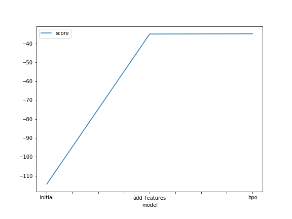
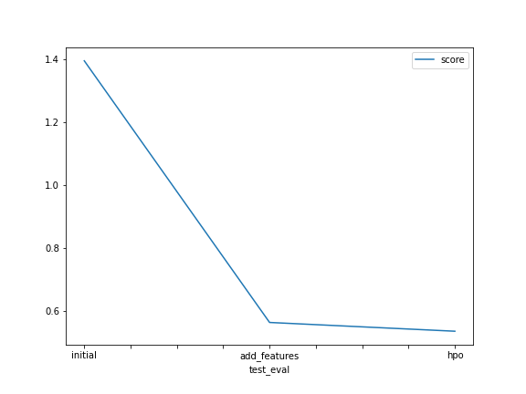

# Report: Predict Bike Sharing Demand with AutoGluon Solution
#### Go Suzui

## Initial Training
### What did you realize when you tried to submit your predictions? What changes were needed to the output of the predictor to submit your results?
The initial training result has very large Root Mean Squared Error -114.467021, because the dependent variable, count ranges from 1 to 977. In addition, predicted value with the test data includes 4 negative values. We need to convert them to 0, since the variable of count cannot be negative in reality. 

### What was the top ranked model that performed?
The top ranked model was WeightedEnsemble_L3.

## Exploratory data analysis and feature creation
### What did the exploratory analysis find and how did you add additional features?
Observing a distribution of each data, I found some variables need to change its data type. For example, data type of a variable of season and weahter should be "category" data type. In addition, datetime variable can be parsed to year, month, day and hour. 

### How much better did your model preform after adding additional features and why do you think that is?
With feature engineering above, the evaluation metrics, RMSE becomes much smaller. This model's RMSE is -35.061334. Changing data types would contribute to better performance, but parsing and adding year, month, day, hour may have huge contribution to it. 

## Hyper parameter tuning
### How much better did your model preform after trying different hyper parameters?
When I set hyper parameter below, a model performance gets better a little, whose RMSE is -34.945763. 

```
hyperparameters = {'GBM':{'num_iterations':500, 
                          'learning_rate':0.1},
                   'XGB':{'objective':'reg:squarederror', 
                          'max_depth':10, 'eta':0.4}, 
                   'CAT': {'depth':10,
                           'learning_rate':0.1}
                  }
hyperparameters_tune_kwargs = {'scheduler' : 'local', 
                               'searcher': 'auto'}
```


### If you were given more time with this dataset, where do you think you would spend more time?
I spend more time to work on feature engineering, because I found it has more impact on model performance through this assignment. 

### Create a table with the models you ran, the hyperparameters modified, and the kaggle score.
|model|hpo1|hpo2|hpo3|score|
|--|--|--|--|--|
|initial|No tuning|No tuning|No tuning|1.39547|
|add_features|No tuning|No tuning|No tuning|0.56478|
|hpo|GBM: num_iterations:500, learning_rate:0.1|XGB:objective:reg:squarederror, max_depth:10, eta:0.4|CAT: depth:10, learning_rate:0.1|0.53693|

### Create a line plot showing the top model score for the three (or more) training runs during the project.

TODO: Replace the image below with your own.



### Create a line plot showing the top kaggle score for the three (or more) prediction submissions during the project.

TODO: Replace the image below with your own.



## Summary
In summary, WeightedEnsemble_L2 with hyper parameter tuning is the best model among the three models I built in this project. RMSE and Kaggle score of the best model was -34.945763 and 0.53693, respectively. You can build machine learning model easily and quickly with AutoGluon. It seems that feature engineering is highly impactful on a performance of model when you use AutoML. 